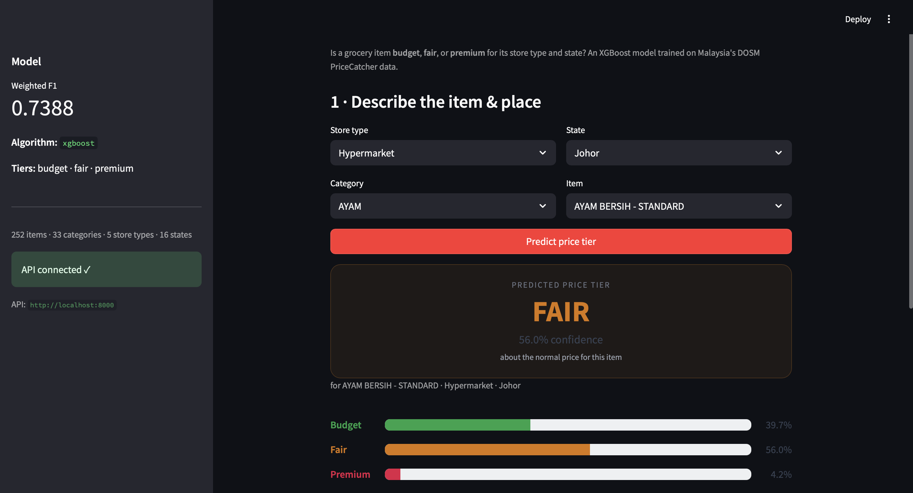

# MakanPredict API

Serves my Project 1 grocery price-tier model over HTTP and a web page, so anyone can check whether a Malaysian grocery item is priced **budget**, **fair**, or **premium** for where it's sold — in one request, no notebook required.

   

---

The model from Project 1 worked, but only if you opened a Jupyter notebook, imported the right module, and typed the exact dictionary it expected. A shopper in Ipoh can't do that, and neither can a recruiter reading this on their phone. MakanPredict API takes that same XGBoost model and puts it behind a single HTTP request: send an item, a shop type, and a state, get back a tier and the three probabilities in about 8 milliseconds. A Streamlit page wraps it in dropdowns — pick *chicken*, *wet market*, *Sabah* and the answer appears as a coloured card — so a model that used to live in a 16 MB `.pkl` on my laptop is now something anyone can use from a web page.

## Try it

```bash
# Chicken at a wet market in Sabah (East Malaysia, higher cost of living)
curl -s localhost:8000/predict -H 'content-type: application/json' -d '{
  "item": "AYAM BERSIH - STANDARD", "premise_type": "Pasar Basah", "state": "Sabah"
}'
```
```json
{"prediction":"premium","confidence":0.778,
 "probabilities":{"budget":0.0335,"fair":0.1886,"premium":0.778}}
```

```bash
# Holland potatoes at a hypermarket in Kedah (a low-cost state) — a budget call
curl -s localhost:8000/predict -H 'content-type: application/json' -d '{
  "item": "UBI KENTANG HOLLAND", "premise_type": "Hypermarket", "state": "Kedah"
}'
```
```json
{"prediction":"budget","confidence":0.9063,
 "probabilities":{"budget":0.9063,"fair":0.0607,"premium":0.0331}}
```

The price is never sent in — it's what *defines* the tiers — so the model predicts the expected tier from context alone (item, shop type, state).



## Results

| Metric | Value |
|---|---|
| HTTP endpoints | 5 JSON + an auto-generated `/docs` |
| Median response time | 7.5 ms (warm, keep-alive connection) |
| Concurrency | 200 / 200 requests at 10 at once, 0 errors (168 req/s) |
| Model served | XGBoost, weighted F1 0.739 (from Project 1) |
| Valid inputs | 5 shop types × 16 states × 252 items (33 categories) |
| Input validation | Pydantic, 3 rejection rules → HTTP 422 |
| Tests | 23 passing |

## How it works

```
 request                  FastAPI + Pydantic         price_classifier.pkl         JSON                  Streamlit
 POST /predict            validate the body,         sklearn pipeline +           {prediction,          dropdowns +
 {item,             ───►  reject unknown        ───► XGBoost.predict_proba   ───► confidence,      ───► result card
  premise_type,           shop type / state            (loaded ONCE,               probabilities}        (reads /metadata
  state}                  → 422                         at startup)                                        for its options)
```

The model is loaded **once**, in FastAPI's startup, not on each request: the `.pkl` is 16 MB and unpickling it plus warming XGBoost takes about 1.3 seconds, so loading per call would make every response roughly 170× slower and let 10 users each trigger their own load. After startup it stays in memory and each prediction reads from it in ~8 ms. **Pydantic sits in front of the model** — a request is checked against the 5 valid shop types and 16 valid states *before* it reaches the model, so a typo like `"Penang"` (the data uses `"Pulau Pinang"`) comes back as a clear 422 instead of a wrong tier. The request-response cycle is deliberately small: JSON in, validate, one `predict_proba` call, JSON out — which is what keeps the median at 7.5 ms and lets one process handle 10 concurrent requests with no errors. The Streamlit page is just another client of the same API: it reads `/metadata` to fill its dropdowns, so the UI can never offer an option the model would reject.

## API endpoints

| Method | Endpoint | What it does |
|---|---|---|
| `POST` | `/predict` | Returns the price tier + confidence + all three probabilities for an item / shop / state |
| `POST` | `/price-check` | Compares a price you enter to the item's national median — the deterministic label rule, not the model |
| `GET` | `/metadata` | Lists the valid shop types, states, categories and items (this is what fills the Streamlit dropdowns) |
| `GET` | `/health` | Liveness check and whether the model is loaded |
| `GET` | `/` | Service info and the endpoint list |
| `GET` | `/docs` | Interactive Swagger UI, generated free by FastAPI |

## Request & response schema

**Request** — `POST /predict` (defined in [`app/schemas.py`](app/schemas.py)):

| Field | Type | Required | Example |
|---|---|---|---|
| `premise_type` | string, one of 5 shop types | yes | `"Pasar Basah"` |
| `state` | string, one of 16 states | yes | `"Sabah"` |
| `item` | string, free text | one of `item` / `item_category` | `"AYAM BERSIH - STANDARD"` |
| `item_category` | string, free text | one of `item` / `item_category` | `"BERAS"` |

**Response** — `200 OK`:

| Field | Type | Example |
|---|---|---|
| `prediction` | string — `budget` \| `fair` \| `premium` | `"premium"` |
| `confidence` | float, 0–1 | `0.778` |
| `probabilities` | object of 3 floats summing to 1 | `{"budget":0.0335,"fair":0.1886,"premium":0.778}` |

## Error handling

A bad request should fail loudly and clearly, not quietly return a wrong tier. Two examples, both real responses:

**Unsupported state** — `"Penang"` isn't in the data (DOSM uses `"Pulau Pinang"`):
```bash
curl -s localhost:8000/predict -H 'content-type: application/json' -d '{
  "item": "AYAM BERSIH - STANDARD", "premise_type": "Pasar Basah", "state": "Penang"
}'
```
```json
HTTP 422
{"detail":[{"type":"value_error","loc":["body"],
  "msg":"Value error, Unsupported state 'Penang'. Valid options: ['Johor', 'Kedah', 'Kelantan', 'Melaka', 'Negeri Sembilan', 'Pahang', 'Perak', 'Perlis', 'Pulau Pinang', 'Sabah', 'Sarawak', 'Selangor', 'Terengganu', 'W.P. Kuala Lumpur', 'W.P. Labuan', 'W.P. Putrajaya'].",
  "input":{"item":"AYAM BERSIH - STANDARD","premise_type":"Pasar Basah","state":"Penang"}}]}
```

**Missing input** — neither `item` nor `item_category` given:
```bash
curl -s localhost:8000/predict -H 'content-type: application/json' -d '{
  "premise_type": "Pasar Basah", "state": "Sabah"
}'
```
```json
HTTP 422
{"detail":[{"type":"value_error","loc":["body"],
  "msg":"Value error, Provide one of 'item' or 'item_category'.",
  "input":{"premise_type":"Pasar Basah","state":"Sabah"}}]}
```

Catching these at the edge means the model only ever sees inputs it understands, and the caller gets a message naming exactly what to fix — not a stack trace, and not a confidently wrong `premium`.

## Project structure

```
makanpredict-api/
├── app/
│   ├── main.py            # FastAPI app: the 5 endpoints; loads the model once at startup
│   ├── schemas.py         # Pydantic request/response models — input validation lives here
│   ├── catalog.py         # reads the .pkl's valid values (dropdowns/metadata) + the price-check
│   ├── predict.py         # Project 1's predict_price_tier — imported as-is, model loaded once
│   └── features.py        # Project 1's feature engineering + the budget/fair/premium label rule
├── models/
│   └── price_classifier.pkl  # the trained model from Project 1 (committed, ~16 MB, loaded once)
├── tests/
│   ├── test_api.py        # endpoints: happy paths, the 422 cases, /metadata, price-check
│   ├── test_model.py      # predict_price_tier contract (shape, probabilities, missing fields)
│   └── test_perf.py       # <200 ms warm latency + 10-way concurrency
├── streamlit_app.py       # the web UI (dropdowns + result card); calls the API, or the model directly
├── reports/
│   └── screenshot.png     # the Streamlit app
├── docs/
│   └── DEPLOY.md          # one-click Streamlit Community Cloud deploy guide
├── requirements.txt
├── pytest.ini
└── README.md
```

## Quick start

**1. Clone** — the trained model ships in the repo, so it runs straight away.
```bash
git clone https://github.com/alfredwj24/makanpredict-api.git
cd makanpredict-api
```

**2. Install** — fastapi, uvicorn, streamlit, pydantic, pytest and the model stack (scikit-learn, xgboost, joblib).
```bash
pip install -r requirements.txt
```

**3. Run the API** — loads the model once, then serves on port 8000. Open http://localhost:8000/docs.
```bash
uvicorn app.main:app --port 8000
```

**4. Run the web app** — in a second terminal. Open http://localhost:8501.
```bash
streamlit run streamlit_app.py
```

**5. Or just call it** — chicken at a wet market in Sarawak:
```bash
curl -s localhost:8000/predict -H 'content-type: application/json' \
  -d '{"item":"AYAM BERSIH - STANDARD","premise_type":"Pasar Basah","state":"Sarawak"}'
# {"prediction":"premium","confidence":0.8576,
#  "probabilities":{"budget":0.0233,"fair":0.1191,"premium":0.8576}}
```

Run the tests:
```bash
pytest -q
# 23 passed
```

## The model it serves

Inference is a single file — `models/price_classifier.pkl` — built and saved by Project 1 ([MakanPredict](https://github.com/alfredwj24/makanpredict)). It bundles the fitted scikit-learn pipeline, the XGBoost model, the feature reference, the item catalog, and the class list, so the API needs nothing else to answer a request. The API loads it once at startup and reads its catalog to build `/metadata`, which means the valid shop types, states and items it advertises are exactly the ones the model knows — they can't drift. The heavy work (cleaning 191,904 records, comparing 3 models, fitting XGBoost) happened once, offline, in Project 1; here the same `.pkl` answers many requests from memory.

## Known limitations

- **Runs locally, not yet on a public URL.** Anyone on the same machine or Wi-Fi can use it, but it isn't live on the internet. *In production:* the Streamlit app already falls back to loading the model in-process, so it one-click deploys to Streamlit Community Cloud (see [`docs/DEPLOY.md`](docs/DEPLOY.md)); the API itself would go behind a host like Render or Fly.io.
- **One frozen model version.** The API serves whatever `.pkl` it loaded at startup, with no way to roll back or A/B two versions. *In production:* version the artifact, add a `/version` endpoint, and load from a model registry so a new model is a deploy, not a file swap.
- **No authentication or rate-limiting.** Any caller can hit `/predict` as often as they like. *In production:* an API key or JWT plus a request limiter (e.g. `slowapi`) behind a gateway.
- **No caching — every request recomputes.** Identical requests re-run the model each time. *In production:* an LRU or Redis cache keyed on the request; the inputs are low-cardinality (5 × 16 × 252), so a cache would absorb most repeat traffic.

## Connection to the portfolio

This is the serving layer of a 3-project set. Project 1 ([MakanPredict](https://github.com/alfredwj24/makanpredict)) builds the model from real DOSM price data; this project wraps that model in an API and a web page so people, not notebooks, can use it. Project 3 (a data pipeline) would close the loop — scheduled jobs that pull each new month of PriceCatcher data, re-label it, and retrain the `.pkl` this API serves. Train once, serve many: the model is built there, offline; it answers requests here, online and often.

## Tech stack

- **Serving** — FastAPI, uvicorn
- **Validation** — pydantic
- **Frontend** — streamlit
- **Model** — scikit-learn, xgboost, joblib
- **Testing** — pytest, httpx

## License

MIT — see [LICENSE](LICENSE). Price data © DOSM, licensed CC BY 4.0.
